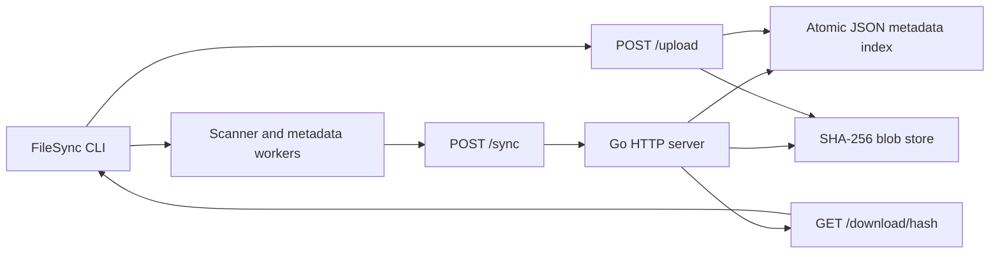

# FileSync

FileSync is a Go client-server file synchronization and backup system. A client scans a registered directory, computes SHA-256 metadata, asks the server for an incremental plan, uploads verified content, downloads server changes, and records a local report.

The project uses a small standard-library implementation. It is suitable for local and LAN demonstrations. Remote deployment should use HTTPS through a reverse proxy.

## Design Goals

- Preserve file contents with content-addressed SHA-256 blobs.
- Transfer only files whose content changed.
- Publish blobs atomically and commit metadata only after hash verification.
- Detect stale-client conflicts instead of silently overwriting changes.
- Keep committed metadata and client configuration recoverable after restart.
- Make server storage persistent and independently backed up.

## Architecture



The server stores folder metadata in `FILESYNC_SERVER_STORAGE/metadata/index.json` and file contents in `blobs/<sha256>`. The default server directory is `storage/server`.

## Synchronization Behavior

1. The client scans the registered local folder.
2. Metadata workers calculate file size, modification time, and SHA-256.
3. The client sends metadata and its last known folder version to `/sync`.
4. The server returns upload, download, delete, and conflict actions.
5. Upload content is written to a temporary file, hashed while streaming, and atomically renamed only when the received hash matches.
6. Server metadata is committed only after the verified blob exists.
7. Conflicts are preserved as `name.conflict-<device><ext>` before the server copy is downloaded.
8. Deletions create persistent server tombstones. A stale client cannot silently resurrect a deleted path.

Failed or corrupt uploads do not replace an existing blob or commit a file index entry.

## Security Model

Set `FILESYNC_AUTH_TOKEN` on the server and clients. When configured, every API endpoint requires:

```text
Authorization: Bearer <token>
```

The server compares tokens in constant time, validates SHA-256 blob identifiers, rejects unsafe relative paths, rejects unregistered device IDs for upload/delete commits, limits upload bodies, and uses HTTP read/write/idle timeouts. Use HTTPS via Caddy, Nginx, or another TLS reverse proxy before exposing the service outside a trusted LAN.

The token is a shared deployment credential, not a multi-user identity system. Remaining limitations include no account management, no encrypted blob store, and no resumable upload protocol. Do not expose an unauthenticated instance to the public internet.

## Requirements

- Go 1.26 or newer matching `go.mod`.
- Optional: Docker and Docker Compose for server deployment.

## Build and Test

```bash
go test ./...
go test -race ./...
go vet ./...
go build ./...
go build -o bin/filesync .
go build -o bin/filesync-client ./cmd/client
go build -o bin/filesync-server ./cmd/server
```

The tests use temporary directories and isolated HTTP servers. They cover metadata planning, verified blob publication, atomic state behavior, tombstones, authentication, traversal rejection, client-server synchronization, and race detection.

## Local Server and Client

Start the server with local defaults:

```bash
export FILESYNC_AUTH_TOKEN='replace-with-a-long-random-token'
go run ./cmd/server
```

The default address is `:8080` and storage is `storage/server`. Override them with:

```bash
export FILESYNC_SERVER_ADDR=':8080'
export FILESYNC_SERVER_STORAGE="$HOME/.local/share/filesync/server"
```

On a client machine, use the same token and register a folder:

```bash
export FILESYNC_AUTH_TOKEN='replace-with-a-long-random-token'
go run . add Docs /home/me/Documents http://server-host:8080
go run . list
go run . sync
go run . status
go run . report
```

Client state is stored under `storage/client`, including configuration, metadata cache files, and reports. The client token may be supplied through `FILESYNC_AUTH_TOKEN` or the `auth_token` field in client config.

## CLI Commands

```text
filesync add                         Register a folder interactively
filesync list                        List registered folders
filesync details [folder-id]         Show folder details
filesync delete [folder-id]          Remove a local relationship
filesync scan <path>                 Scan a folder
filesync compare <source> <dest>     Compare two local folders
filesync changes [folder-id]         Preview a server plan
filesync sync [folder-id]            Synchronize a folder
filesync status [--json]             Show local synchronization status
filesync report [folder-id]          Show the latest report
filesync server start|stop|status|logs
filesync version
filesync help <command>
```

Folder-aware commands select the only registered folder automatically and show a numbered selection when several folders are registered. Relationship removal is local configuration removal; it does not delete server blobs.

## Docker Deployment

```bash
export FILESYNC_AUTH_TOKEN="$(openssl rand -hex 32)"
docker compose up --build -d
docker compose logs -f filesync-server
```

The Compose file publishes port 8080 and mounts the named `filesync-data` volume at `/var/lib/filesync`. Back up that volume, or the directory used by `FILESYNC_SERVER_STORAGE`, before upgrades and maintenance. Put a TLS reverse proxy in front of the service for remote access.

## Two-Device Demonstration

1. Start the server with a token and persistent storage.
2. Register `Demo` from Client A and Client B using the same server and token.
3. Create `hello.txt` on Client A and run `filesync sync`.
4. Run `filesync sync` on Client B and verify the restored bytes and SHA-256 hash.
5. Modify the file on Client A and synchronize again; Client B receives the modified version.
6. Run sync without changes and observe that the report contains no upload.
7. Interrupt a transfer or use an invalid upload hash; verify that the server retains the previous valid blob.
8. Modify the same file independently on both clients. The stale client receives a conflict copy rather than silently losing either version.
9. Delete a synchronized file and sync. The server records a tombstone; an older client cannot silently resurrect that path.

## Storage and Recovery

The server metadata index is written through a temporary file and atomic rename. Blobs are content-addressed and published atomically. A backup must include both `metadata/index.json` and `blobs/`; restoring only one produces an incomplete server state. The current implementation does not include automated orphan-blob garbage collection or a full startup repair command, so retain backups until those tools exist.

## Project Structure

```text
cmd/cli             Unified user-facing CLI
cmd/client          Minimal client executable
cmd/server          Standalone server executable
internal/client     Client config, planning, upload/download orchestration
internal/server     HTTP API, metadata store, blob store, tombstones
internal/metadata   Concurrent file metadata generation
internal/scanFiles  Filesystem scanning
internal/comparator Local metadata comparison
internal/synchronizer Legacy local synchronization engine
internal/models     Shared request, plan, and report types
internal/report     Atomic report persistence
utils/hash          SHA-256 file hashing
```

## Current Limitations

- Shared bearer token rather than per-user accounts and granular ACLs.
- HTTPS is expected from a reverse proxy rather than terminated by the Go server.
- No resumable or chunked transfer protocol.
- No automatic orphan-blob cleanup or metadata repair command.
- JSON metadata is appropriate for a small single-server deployment, not a high-write multi-node service.
- File merges are not attempted; conflicting versions are preserved as separate files.

## License

See [LICENSE](LICENSE).
